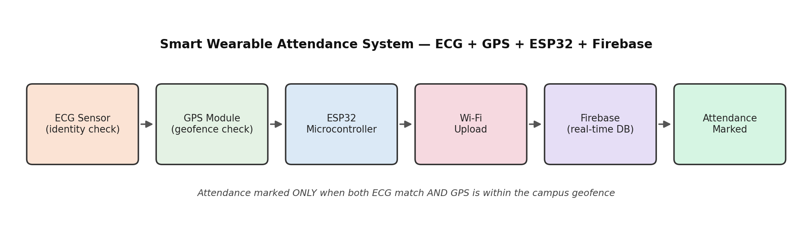

# 💓 Smart Wearable Attendance System — ECG + GPS + ESP32

An IoT-based attendance system that verifies *who* you are and *where* you are before marking you present — combining ECG-based biometric identity with GPS geofencing, on an ESP32, synced to Firebase in real time.


---

## 📌 Overview

This project provides an automated, secure, and reliable attendance monitoring system by combining physiological biometrics with location tracking. ECG signals act as a unique biometric identifier, ensuring attendance is only marked when the authorized person is actually wearing the device — eliminating proxy attendance. GPS-based geofencing independently verifies that the person is physically present within the designated campus boundary. Attendance is only recorded when **both** conditions are satisfied, and the result is synced to Firebase in real time for storage and analysis.

The goal was to remove two persistent problems with manual attendance systems: proxy attendance (someone marking present for a friend who isn't there) and the administrative overhead of manual tracking.

<p align="center">
  
</p>

## 🧩 How it works

1. **ECG authentication** — the wearable's ECG sensor captures the wearer's cardiac signal, used as a biometric identity check. This confirms the device is being worn by its registered owner, not handed off to someone else.
2. **GPS geofencing** — the GPS module checks the device's current coordinates against a predefined campus boundary.
3. **ESP32 decision logic** — attendance is marked present only when **both** the ECG identity check and the GPS geofence check pass.
4. **Firebase sync** — once verified, the attendance record is pushed to Firebase in real time, making it available instantly for dashboards, reports, or audits.

## ✅ Applications

- Automated attendance marking without manual intervention
- Prevention of proxy or fake attendance using ECG-based biometric verification
- Real-time location verification through GPS-based geofencing
- Secure and reliable storage of attendance data in Firebase
- Improved accuracy and transparency in attendance records
- Reduced administrative workload and time consumption
- Suitable for colleges, universities, and other educational institutions
- Useful in workplaces for employee attendance and access control
- Applicable in secure or restricted environments requiring identity verification
- Enables real-time monitoring and future analysis of attendance data

## 🎯 Use cases

- A student's attendance is automatically marked when they enter the campus wearing the authorized device.
- Faculty can view real-time attendance status without manual roll calls.
- The system prevents a student from marking attendance for someone else (proxy attendance).
- Attendance is denied if the person is outside the predefined geofenced area.
- Administrators can access securely stored attendance records for audits and reports.
- Employees' attendance is recorded automatically when they arrive at the workplace.
- The system ensures only authorized personnel can access restricted areas.
- Attendance data can be analyzed later to track regularity and punctuality.

## ⚠️ Design challenge

A core engineering challenge in this system is signal reliability: ensuring ECG readings and GPS coordinates are stable and accurate enough to support real-time verification, since noisy biometric data or GPS drift near geofence boundaries can produce false negatives or false positives. The decision logic is built to require both checks to independently pass, which reduces the chance of either sensor's noise alone triggering an incorrect result.

## ⚙️ Tech stack

`ESP32` · `ECG Sensor` · `GPS Module` · `Firebase Realtime Database` · `C++ / Arduino`

## 📁 Repo structure

```
├── firmware/
│   └── esp32_attendance.ino       # ECG + GPS read, geofence check, Firebase upload
├── docs/
│   └── literature_survey.docx
├── assets/
│   └── block_diagram.png
└── README.md
```

## 👤 Author

**Aniket Patil**
CS (AI) undergraduate, KLE Technological University
